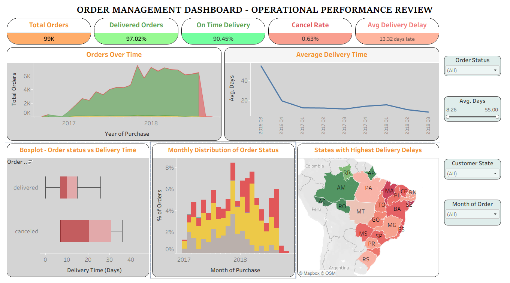

# 📦 Order Management Dashboard – Operational Performance Analysis

## 📌 Overview
This project presents an interactive **Order Management Dashboard** built using the Brazilian **Olist E-commerce Dataset**.  
The dashboard focuses on analyzing operational efficiency, delivery performance, fulfillment delays, and regional logistics trends to identify bottlenecks in the order lifecycle.

The analysis helps businesses improve:
- Delivery efficiency
- Order processing performance
- Regional logistics planning
- Customer satisfaction

---

## 🚀 Objectives
- Analyze order fulfillment performance
- Identify delayed delivery patterns
- Track operational KPIs
- Understand regional delivery inefficiencies
- Improve decision-making using data visualization

---

## 📷 Dashboard Preview


---

## 🛠️ Tools & Technologies
- **Tableau** – Dashboard creation & visualization
- **Microsoft Excel** – Data cleaning & preprocessing

---

## 📊 Key Insights
### ✅ Delivery Performance Trends
- Delivery performance showed gradual improvement over time.
- Faster fulfillment was observed after operational optimization.

### 📈 Peak Demand Impact
- High-demand seasons increased shipping and delivery delays.
- Operational load directly impacted fulfillment efficiency.

### 🌍 Regional Logistics Analysis
- Certain regions consistently experienced longer delivery times.
- Logistics infrastructure disparities affected delivery success.

### ⏳ Order Processing Bottlenecks
- Delays were observed mainly between:
  - Order approval
  - Shipment dispatch
  - Final delivery stages

---

## 💡 Recommendations
- Optimize logistics operations in high-delay regions.
- Improve warehouse and order processing efficiency.
- Scale operations proactively during peak demand periods.
- Introduce predictive monitoring for delivery delays.
- Enhance customer communication during shipment delays.

---

## 📁 Project Structure

```bash
order-management-dashboard/
│
├── README.md
├── order-management-dashboard-report.pdf
├── order-dashboard.twb
│
├── images/
│   └── dashboard.png
│
├── docs/
│   ├── insights.md
│   └── calculations.md
│
└── data/
    └── README.md
